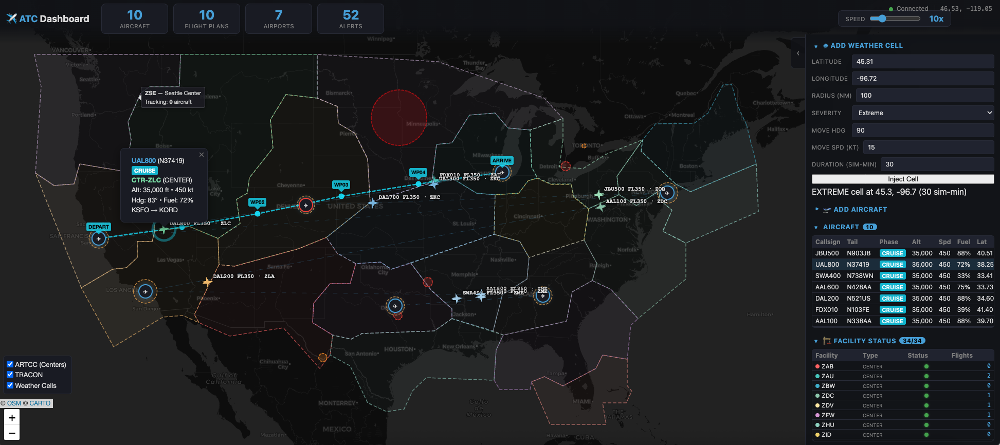

# National Air-Traffic Control System — RTI Connext DDS vs gRPC

A multi-application simulation of a national air-traffic control system implemented **twice** — once with [RTI Connext DDS](https://www.rti.com/products/connext) and once with [gRPC](https://grpc.io/) — to compare a **data-centric** publish/subscribe architecture against a **client-server** RPC architecture for the same real-time distributed scenario.

Both implementations share the same scenario configuration, application roles, and data flows. Aircraft fly between airports while control towers, TRACON facilities, and en-route centers coordinate traffic. The key difference is **how** applications communicate:

| | Connext DDS | gRPC |
|---|---|---|
| **Paradigm** | Peer-to-peer pub/sub with automatic discovery | Explicit client-server with mDNS discovery |
| **Data model** | Shared distributed state (Topics + QoS) | RPC service definitions (Protocol Buffers) |
| **Multicast** | Native (1 write → N readers) | N point-to-point streams |
| **Late-join** | Built-in (transient-local durability) | Application-level state replay |
| **QoS** | Declarative (deadline, liveliness, ownership) | Must be implemented manually |

This repository is part of the [RTI Connext comparison series](https://github.com/rticommunity) alongside the [tractor-fleet demo](https://github.com/rticommunity/rticonnextdds-comparison-tractor-fleet).

## Scenario

A simulated national air-traffic control system spanning multiple airports. 



Aircraft fly between airports while control towers, TRACON facilities, and en-route centers coordinate traffic flow, issue instructions, and manage handoffs — just like the real national airspace system.

### Components

| Component | Role | Instances |
|---|---|---|
| **Airplane** | Position reporting, flight plan filing, gate requests | 1 per aircraft |
| **Airport** | Weather reports, runway status, gate assignment | 1 per airport |
| **Control Tower** | Terminal-area clearances, runway management | 1 per airport |
| **TRACON** | Arrival sequencing, departure handoffs | 1 per TRACON |
| **En-Route Center** | Separation monitoring, weather rerouting, sector handoffs | 1 per center |
| **Flight Plan Service** | Central plan validation and publishing | 1 |
| **Weather Service** | Convective cell generation for en-route hazards | 1 |
| **Dashboard** | Web-based real-time map and monitoring | 1 |

### Data Flows

```
┌──────────────┐    handoffs   ┌──────────────┐
│ En-Route     │◄─────────────►│ En-Route     │
│ Center A     │               │ Center B     │
└──────┬───────┘               └───────┬──────┘
       │                               │
  ┌────▼─────┐                   ┌─────▼────┐
  │ TRACON 1 │                   │ TRACON 2 │
  └────┬─────┘                   └─────┬────┘
       │                               │
  ┌────▼──────┐                  ┌─────▼─────┐
  │ Tower 1   │                  │ Tower 2   │
  │(Airport 1)│                  │(Airport 2)│
  └────┬────-─┘                  └─────┬──-──┘
       │                               │
  ✈ ✈ ✈ ✈                         ✈ ✈ ✈ ✈
 Aircraft at                      Aircraft at
 Airport 1                        Airport 2

       ✈  ✈  ✈  ✈  ✈  (en-route aircraft)

┌─────────────────────┐   ┌───────────────────┐
│ Flight Plan Service │   │ Weather Service   │
└─────────────────-───┘   └───────────────────┘

┌─────────────────────┐
│ Dashboard (observer)│
└─────────────────────┘
```

### Interaction Patterns

- **Publish/Subscribe:** Position reports, weather, runway status, alerts, tracking state
- **Command/Response:** Controller instructions → pilot acknowledgments, handoff initiation → acceptance
- **Request/Reply:** Flight plan filing, gate assignment

## Implementations

### Connext DDS

Built with RTI Connext DDS (Python). See [`connext_dds/`](connext_dds/) for the full implementation.

### gRPC

Built with gRPC + Protocol Buffers (Python). See [`grpc/`](grpc/) for the full implementation.

## Comparison: How Do the Resulting Systems Differ?

Both implementations produce the same ATC demo — but deploying them in a realistic airspace reveals fundamental differences in robustness, scalability, and extensibility. Writing the code is straightforward in either case (especially with AI assistance); what matters is what the **running system** delivers.

### At Realistic Scale

The US national airspace handles ~5,000 aircraft simultaneously across ~20 en-route centers, ~180 TRACONs, and ~500 towered airports. The differences between the two architectures compound as the system grows.

#### Connection and thread explosion

In gRPC, every consumer-producer relationship is a dedicated TCP stream with its own thread. In DDS, a DataReader receives from all matched writers regardless of how many there are.

| Scenario | gRPC | DDS |
|---|---|---|
| Center tracking 250 aircraft (positions only) | 250 TCP streams + 250 threads | 1 DataReader |
| 20 centers × 250 aircraft | ~5,000 position streams system-wide | 20 DataReaders total |
| Add a dashboard observing all centers | +20 streams per data type | +1 DataReader per topic |
| **Full NAS: 5,000 aircraft, 700 facilities** | **Hundreds of thousands of TCP streams**, each with a thread, TCP socket, and keepalive overhead | **Each writer calls `write()` once** — middleware delivers to matched readers. Thread and connection count are independent of how many producers exist |

At demo scale (10 aircraft, 34 facilities) this may be acceptable. At production scale, the gRPC system is managing orders of magnitude more OS resources — sockets, threads, memory buffers — than the DDS system, all in application code.

#### Cascading failure amplification

This is arguably more consequential than the connection count. When a single aircraft server crashes in gRPC, every facility that was streaming from it gets a simultaneous exception — 20+ threads across the system hit errors at once, each must independently retry with its own backoff. When a center restarts, hundreds of streams die simultaneously.

In DDS, the middleware detects the liveliness loss once and notifies each reader via callback — no connection teardown, no thread cleanup, no retry loops. When the crashed participant restarts, re-discovery is automatic.

A 30-second network partition doesn't just break the streams between the affected regions — it breaks every stream that traverses the affected link. In gRPC, each of those streams recovers independently on its own retry schedule; the system may take minutes to fully reconverge. In DDS, the reliability protocol queues and retransmits automatically — for reliable data, the application doesn't even know the partition occurred.

#### Fan-out bandwidth

An aircraft publishing position at 5 Hz (~200 bytes per sample):

| | gRPC | DDS |
|---|---|---|
| **Per aircraft, 34 interested facilities** | Server sends 34 copies (one per TCP stream) = ~34 KB/s | Application calls `write()` once = ~1 KB/s from the aircraft; on the wire, writer-side filters send only to the ~2-3 centers whose bounding box matches = ~2-3 KB/s |
| **5,000 aircraft system-wide** | ~170 MB/s of position data alone | ~5 MB/s of application writes; ~12-15 MB/s on the wire after writer-side filtering |

Writer-side content filtering is a key differentiator: DDS evaluates each subscriber's filter at the publisher, so data that no reader needs is never sent — reducing CPU use, bandwidth, and the number of network packets. In gRPC, the server sends to every connected stream regardless of whether the consumer needs the data, because there is no built-in mechanism to filter on the writer side.

### Two Examples: Data-Centric vs. Point-to-Point

The architectural difference shows up in both publish-subscribe flows and command flows. Here is how each implementation handles them, drawn directly from the code in this repo.

#### Example 1 — Publishing position updates (pub-sub)

An aircraft publishes its position at 5 Hz. Multiple facilities (centers, TRACONs, towers, dashboard) need to receive it.

**DDS — data-centric:** The aircraft calls `write()` once on the `AircraftPosition` topic. The middleware delivers the sample to every matched reader — the application has no idea how many consumers exist or where they are. Each facility's reader has a content filter (e.g., a center filters by bounding box, a tower filters by tail number) evaluated at the *writer* side, so data that doesn't match never crosses the network. Adding a new consumer (say, a military coordinator filtering `altitude > 40000`) requires zero changes to the aircraft application — just a new reader with a new filter.

**gRPC — point-to-point:** The aircraft runs a gRPC server exposing `StreamPositions`. Each facility discovers the aircraft via Zeroconf, opens a TCP stream, and receives positions on its own dedicated connection. The aircraft server sends the same data N times — once per connected stream. Server-side filtering is limited to simple key matches (tail number, airport code) that were anticipated at build time. Adding a new filter field (e.g., altitude threshold) requires changing the `.proto`, regenerating stubs, updating the aircraft server, and redeploying.

**What this means at scale:** With 5,000 aircraft and 700 facilities, DDS: each aircraft calls `write()` once at 5 Hz — the middleware and network handle delivery. gRPC: hundreds of thousands of TCP streams, each managed by application code.

#### Example 2 — Handing off an aircraft between centers (command)

Center ZNY detects an aircraft leaving its airspace and needs to transfer control to Center ZLA.

**DDS — data-centric:** ZNY writes a `Handoff` sample to the shared **Handoff topic** with `to_controller_id = "CTR-ZLA"` and `status = INITIATED`. This is a single `write()` — ZNY doesn't know or care where ZLA is on the network. ZLA has a content-filtered reader on the same topic (`to_controller_id = 'CTR-ZLA'`); the middleware delivers only matching samples. ZLA reads the INITIATED sample and writes an ACCEPTED sample back to the **same topic**. ZNY's filter picks it up. Every other observer (dashboard, supervisory tools) **automatically sees both samples** if their filter matches — all observers converge on the same state via `SHARED_OWNERSHIP` + `BY_SOURCE_TIMESTAMP`, with no additional code. Neither center opens a connection to the other. ZNY only needs to know ZLA's *controller ID* (a logical name), not its network address.

**gRPC — point-to-point RPC:** ZNY calls `discovery.get_endpoint("center", "ZLA")` to look up ZLA's host:port from Zeroconf, opens a new TCP channel, and calls `stub.SendHandoff(ho, timeout=5)` — a blocking unary RPC. ZLA's handler accepts and returns `HandoffAck(success=True)`. If ZLA hasn't been discovered yet, the handoff fails (warning log, no retry). If the network dies mid-RPC, ZNY gets a timeout exception with no built-in reconciliation. Other observers (dashboard) don't see this exchange — they only see what each center publishes on its own broadcaster stream, which they must be separately subscribed to.

**What this means operationally:** In DDS, a handoff is a write to a shared data space — the middleware handles delivery, filtering, and conflict resolution. In gRPC, a handoff is a direct call between two specific processes — the sender must know the receiver's address, manage the connection, handle failures, and every observer must independently subscribe to every center to get the full picture.

### When Connectivity Is Temporarily Lost

**Scenario:** A 30-second network partition between Center ZNY (New York) and Center ZLA (Los Angeles) while aircraft are being handed off between them.

| | Connext DDS | gRPC |
|---|---|---|
| **Reliable data (handoffs, instructions)** | DDS queues unacknowledged samples at the writer. When connectivity resumes, the reliability protocol retransmits them automatically — no application code involved | All TCP streams die immediately. Every consumer hits an exception and must retry independently |
| **Who controls the aircraft?** | Both centers may have written conflicting tracking updates during the partition. On reconnect, `BY_SOURCE_TIMESTAMP` ordering ensures **all readers converge on the newest update automatically** — the middleware resolves the conflict | If ZNY sent a `SendHandoff` RPC and the network died before ZLA's response arrived, ZNY timed out. ZLA may have already accepted. **The two centers now disagree on who controls the aircraft** — there is no middleware mechanism to reconcile |
| **Position data** | Best-effort samples during the outage are lost by design (stale positions have no value). The next position arrives within 200ms of reconnection | Streams must be re-established. Reconnection depends on each consumer's retry backoff — could take seconds to minutes |
| **Recovery** | Milliseconds after connectivity resumes — middleware re-delivers queued reliable data and reasserts liveliness | Each of the N×M broken streams must reconnect independently, re-discover via Zeroconf (whose mDNS registrations may have expired), and replay server-side caches |

### When a Controller Facility Restarts

| | Connext DDS | gRPC |
|---|---|---|
| **Detection** | Liveliness lease expires after 5s — every subscriber is notified automatically via middleware callback | Each connected client detects the TCP stream error independently; detection time varies by client |
| **Recovery** | Restarted facility re-joins the domain; middleware re-discovers it; transient-local data (flight plans, tracking state, runway status) is delivered automatically from other participants' caches | Restarted facility re-registers with Zeroconf; each consumer must detect the new registration, open a fresh stream, and hope the server's in-memory cache was rebuilt (it wasn't — it crashed) |
| **State after restart** | Facility immediately receives current state of the world from peers who cached it | Facility starts with empty caches; must wait for fresh data to arrive |

### Adding a New Component to the System

**Scenario:** You want to add a military airspace coordinator that monitors all aircraft above 40,000 ft.

| | Connext DDS | gRPC |
|---|---|---|
| **Data access** | Create a DDS reader on the `AircraftPosition` topic with a content filter: `"altitude > 40000"`. Done. No changes to any existing application. The middleware evaluates the filter at each publisher and delivers only matching positions | Must connect to every aircraft's gRPC server and open a `StreamPositions` stream. Either: (a) receive all positions and filter client-side, or (b) add a new filter field to the `.proto` definition, regenerate stubs, update every aircraft server, redeploy them all |
| **Discovery** | Set appropriate partitions and the coordinator discovers all participants automatically | Must browse Zeroconf for all `_atc-aircraft._tcp` services and maintain a connection thread per aircraft |
| **Impact on existing system** | None — existing applications are unaware the coordinator exists | If server-side filtering is needed, every aircraft server must be modified and redeployed |

### Send Calls and Network Packets

The difference shows up at two levels: what the **application code** does, and what goes **on the wire**. Both matter — application-level sends consume CPU and require connection management; network packets consume bandwidth and router resources.

**Scenario:** 5,000 aircraft publishing positions at 5 Hz (~200 bytes/sample), 20 en-route centers consuming positions.

#### Application-level send/write calls per second

| | Connext DDS | gRPC |
|---|---|---|
| **Per aircraft, per update** | 1 `write()` call — the middleware delivers to all matched readers | 20 `send()` calls — one per connected center stream |
| **System-wide** | 5,000 × 5 = **25,000/s** | 5,000 × 5 × 20 = **500,000/s** |
| **Ratio** | | **20×** |

In gRPC, each center connects to **every** aircraft server regardless of location — there is no way to filter before connecting. Each stream requires its own `send()` call in the aircraft server.

In DDS, the aircraft calls `write()` once. It doesn't know how many readers exist.

#### Network packets per second (DDS on WAN, no multicast)

Without multicast, the DDS middleware sends a separate packet to each matched reader — but **writer-side content filters** reduce the number of matched readers. Each aircraft is typically in 1 center's region, with 1-2 neighbors having overlapping bounding boxes, so on average ~2.5 centers match per aircraft.

| | Connext DDS (writer-side filtering) | gRPC |
|---|---|---|
| **Matched/connected readers per aircraft** | ~2.5 (only centers whose filter matches) | 20 (every center connects, filters locally) |
| **Network packets/s** | 5,000 × 5 × 2.5 = **62,500** | 5,000 × 5 × 20 = **500,000** |
| **Ratio** | | **8×** |

The 8× network difference comes entirely from writer-side filtering eliminating ~87% of the sends that gRPC must make because it cannot filter before connecting.

#### What happens when you add TRACONs and towers

The 20× and 8× ratios above are for **centers only**. Adding 180 TRACONs, 500 towers, and a dashboard — each of which also connects to every aircraft in gRPC — pushes the gRPC numbers dramatically higher while the DDS `write()` count stays at 25,000/s (one write per aircraft regardless of consumer count).

#### Content filtering

| | Connext DDS | gRPC |
|---|---|---|
| **Who defines filters** | The subscriber, at runtime — any SQL-like expression over any field (e.g., `altitude > 40000`) | The server developer, at build time — limited to simple key matches (tail number, airport code) that were anticipated in the `.proto` |
| **Where filters run** | At the writer — unmatched data never leaves the publisher | At the server or client — the TCP stream exists regardless |
| **Adding a new filter** | New subscriber defines it; no existing code changes | Requires `.proto` change, stub regeneration, server redeployment |

### Real-Time Guarantees

DDS enforces QoS policies in the middleware — they work regardless of application language, and changing them is a configuration file edit, not a code change:

| Guarantee | Connext DDS | gRPC |
|---|---|---|
| **"Alert me if position data stops arriving"** | Deadline QoS (200ms) — middleware fires violation callback | Application must track last-received timestamp per aircraft and check it periodically |
| **"Tell me if a center goes offline"** | Liveliness lease (5s) — automatic detection | Application must detect TCP stream failure or missing heartbeat |
| **"During handoff, ensure all observers agree on who controls the aircraft"** | `SHARED_OWNERSHIP` + `BY_SOURCE_TIMESTAMP` — middleware resolves conflicts | No built-in mechanism — application must implement its own conflict resolution |
| **"Don't waste bandwidth on stale positions"** | Lifespan QoS (1s) — middleware auto-discards old samples | Application must implement TTL logic in every cache |
| **"New subscribers should see current state immediately"** | Transient-local durability — built into the middleware | Application must maintain per-data-type caches and replay them on each new stream connection |

### Summary

| | Connext DDS | gRPC |
|---|---|---|
| **Architecture** | Peer-to-peer data bus — applications publish and subscribe to shared topics | Client-server — each data producer runs a server, each consumer opens explicit connections |
| **Scales by** | Adding participants to the data bus — application writes once, middleware handles delivery | Adding TCP streams — O(N×M) connections and threads, each managed by application code |
| **Recovers from failures** | Automatically — middleware handles reconnection, data retransmission, and state convergence | Manually — each application must implement retry, reconnect, and state reconciliation |
| **Extends with new components** | New subscribers join without touching existing code; filters are subscriber-defined at runtime | New consumers must connect to every relevant server; new filters require coordinated server changes |
| **Configuration** | Declarative QoS in a single XML file | QoS-equivalent logic scattered across application code |
| **Trade-off** | Commercial license required | Zero licensing cost; widely-known API |

Both approaches produce working demos. Only one is production-ready without additional engineering — eventual consistency, content-based filtering, partition isolation, connect/disconnect resilience, incremental deployment, and robust discovery are already built into DDS. With gRPC, you would have to design and implement each of those yourself. 

## Prerequisites

### Connext DDS

- **RTI Connext DDS license file** (no Connext installation required — the Python
  package is installed automatically from PyPI).
  A free evaluation license is available at [rti.com/free-trial](https://www.rti.com/free-trial).
  Set `RTI_LICENSE_FILE` to point to your license file before running the demo.
- Python 3.10+

### gRPC

- Python 3.10+
- No license required

## Quick Start

### Connext DDS

```bash
# Clone the repository
git clone https://github.com/rticommunity/rticonnextdds-comparison-air-traffic.git
cd rticonnextdds-comparison-air-traffic

# Set up virtual environment and install dependencies
source setup.sourceme

# Run the demo (defaults to all apps, 60 min)
./connext_dds/scripts/demo_start.sh
```

Open http://localhost:8050 for the real-time dashboard.

### gRPC

```bash
# Set up virtual environment and install dependencies
source setup.sourceme

# Run the demo
./grpc/scripts/demo_start.sh
```

### Docker

```bash
# Build the image (from repo root)
docker build -f docker/Dockerfile -t atc-demo .

# Run the full demo (all components)
docker run -v ./rti_license.dat:/tmp/rti_license.dat -p 8050:8050 atc-demo

# Run a single component
docker run -v ./rti_license.dat:/tmp/rti_license.dat -p 8050:8050 atc-demo dashboard
```

`--network host` is recommended so DDS multicast discovery works between containers. Pass any component name (`dashboard`, `center`, `tower`, `tracon`, `airport`, `airplane`, `flightplan`, `weather`) or `all` (default). On Linux, add `--network host` for DDS discovery across multiple containers.

See [`connext_dds/README.md`](connext_dds/README.md) for prerequisites, installation, detailed options, and design notes.

## Repository Structure

```
├── README.md                      # This file
├── air_traffic_scenario.json      # Shared scenario config (both implementations)
├── setup.sourceme                 # Environment setup (source, not execute)
├── requirements/
│   └── connext_dds.txt            # Python dependencies (Connext DDS)
├── connext_dds/                   # RTI Connext DDS implementation
│   ├── README.md                  # Approach overview & quick start
│   ├── DESIGN.md                  # DDS architecture deep dive
│   ├── air_traffic_types.idl      # Shared IDL type definitions
│   ├── air_traffic_qos.xml        # Shared QoS profiles
│   ├── diagrams/                  # Design diagrams
│   ├── scripts/                   # Demo launcher
│   ├── python/                    # Python implementation
│   └── cpp/                       # C++ implementation (planned)
├── grpc/                          # gRPC implementation
│   ├── DESIGN.md                  # gRPC architecture deep dive
│   ├── air_traffic_types.proto    # Shared Protocol Buffer definitions
│   ├── scripts/                   # Demo launcher
│   ├── python/                    # Python implementation
│   └── specs/                     # App specifications
└── docs/
    ├── design_process/            # How we built this (AI-assisted design journey)
    └── reference/                 # ATC domain reference material
```

## How We Built This

This project was designed iteratively using AI tools with and without [RTI's Connext AI Design Expert (Connext MCP server)](https://chatbot.rti.com/docs/getting-started). The [`docs/design_process/`](docs/design_process/) directory documents this journey, including prompts, design iterations, and a comparison of using Connext AI Design Expert vs no Expert approaches.

## License

Apache-2.0 — see [LICENSE](LICENSE).
