# RTI Connext DDS Design — National Air-Traffic Control System

> **Purpose:** Map the technology-agnostic [architecture overview](architecture_overview.md) onto RTI Connext DDS 7.7.0 Pro concepts: domains, partitions, IDL4 data types, QoS profiles, content-filtered topics, participants, and the request/reply API.
>
> **Design guidance sourced from:** RTI Connext AI (MCP) and official RTI documentation.

---

## 1. Domain Architecture

### 1.1 Single Operational Domain

A single DDS domain is recommended for core ATC operations. This is the best fit because:

- Simplest topology — no Routing Service needed to exchange operational data.
- Aircraft move dynamically between airport-local and en-route scopes; a single domain avoids multiple participants or routed data paths.
- Partitions + Content-Filtered Topics provide sufficient logical separation.

| Domain ID | Name | Purpose |
|---|---|---|
| `0` | **ATC Operations** | All real-time air-traffic data |

Additional domains should only be added for hard isolation boundaries:

| Domain ID | Purpose |
|---|---|
| `1` | Training / Simulation |
| `2` | Analytics / Cloud backhaul |
| `3` | Administration / Monitoring |

### 1.2 Partition Strategy

Partitions control **who can match and communicate**. They are lightweight, dynamically changeable, and reduce unnecessary discovery overhead.

**Rule of thumb:**
- **DomainParticipant Partitions** = discovery isolation ("should these entities even discover each other's endpoints?")
- **CFTs** = fine-grained data selection ("they match, but each wants different samples")

> **Note:** DomainParticipant partitions are a Connext extension (not standard DDS). When two participants have non-matching DP partitions, **no endpoint discovery occurs between them**, reducing discovery traffic, CPU, and memory. Matching rules:
> - A **wildcard** is matched only against **concrete** partition names on the remote side (e.g., `OPS/*` matches `OPS/TERMINAL/N90`). Wildcards are filters, not memberships.
> - Two **wildcards** never match each other (e.g., `OPS/FPS/*` vs `OPS/AIRPORT/*` → no match).
> - No wildcard pattern — not even `*` — matches the empty partition `""` via pattern matching.
> - **Wildcard-only fallback:** if a partition list contains **only** wildcards and **zero** concrete names, Connext auto-assigns the entity to the default partition `""`. Two wildcard-only participants therefore discover each other through `""`. Adding even one concrete partition disables this fallback.
> - In this system the only wildcard-only participant is the **Dashboard** (`OPS/*`). All others carry at least one concrete partition, so the `""` fallback does not affect them.

This system uses **only DomainParticipant partitions** (no Publisher/Subscriber partitions). DP partitions handle discovery isolation, and CFTs handle data-level filtering. This avoids a redundant configuration layer.

#### Partition Expressions

| Partition Expression | Purpose |
|---|---|
| `OPS/AIRPORT/<code>` | Airport scope (e.g., `OPS/AIRPORT/KJFK`) |
| `OPS/TERMINAL/<tracon_id>` | TRACON scope (e.g., `OPS/TERMINAL/N90`) |
| `OPS/TERMINAL/*` | Wildcard — matches all TRACON scopes |
| `OPS/ENROUTE/<center_id>` | En-route center scope (e.g., `OPS/ENROUTE/ZNY`) |
| `OPS/ENROUTE/*` | Wildcard — matches all en-route scopes |
| `OPS/AIRPORT/*` | Wildcard — matches all airport scopes |
| `OPS/FPS/<name>` | Flight Plan Service instance scope (e.g., `OPS/FPS/main`) |
| `OPS/FPS/*` | Wildcard — matches any FPS instance |
| `OPS/WEATHER/*` | Wildcard — matches weather service scope |

#### DomainParticipant Partition Assignment — "Reach Up" Design

Each entity joins its **own** scope partition plus the **next tier up**, so that
adjacent layers share exactly one concrete partition and discover each other's
endpoints. This keeps configuration local: a tower only needs to know its own
airport code and its serving TRACON; a TRACON only needs its own ID and its
serving center.

| Application | DP Partitions | Rationale |
|---|---|---|
| Tower | `OPS/AIRPORT/<code>`, `OPS/FPS/*`, `OPS/TERMINAL/<serving_tracon>` | Reaches up into its TRACON scope; discovers FPS |
| Airport | `OPS/AIRPORT/<code>`, `OPS/TERMINAL/<serving_tracon>` | Same as tower minus FPS — no flight-plan interaction |
| TRACON | `OPS/TERMINAL/<id>`, `OPS/FPS/*`, `OPS/ENROUTE/<serving_center>` | Reaches up into its center scope; discovers FPS |
| Center | `OPS/ENROUTE/<center_id>`, `OPS/ENROUTE/*`, `OPS/FPS/*` | Cross-center handoffs via `OPS/ENROUTE/*`; discovers FPS |
| Airplane | `OPS/FPS/*`, `OPS/TERMINAL/*`, `OPS/ENROUTE/*`, `OPS/AIRPORT/<origin>`, `OPS/AIRPORT/<destination>` | Discovers origin/destination towers, all TRACONs and centers along route, plus FPS for filing |
| Flight Plan Service | `OPS/FPS/<name>` | Concrete instance partition (e.g., `OPS/FPS/main`); consumers match via `OPS/FPS/*` |
| Dashboard | `OPS/*` | Global observer — single wildcard discovers all `OPS/` endpoints |
| Weather Service | `OPS/WEATHER/*`, `OPS/ENROUTE/*` | Publishes convective cells; center wildcard ensures centers discover its writer |

#### Discovery Isolation Examples

With DP partitions, the following pairs **never exchange endpoint discovery** (no shared DP partition):
- Tower KJFK ↔ Tower KLAX (different airports, different TRACONs)
- Tower KJFK ↔ Center ZLA (different scopes, no bridging partition)
- Airplane (KJFK→KLAX) ↔ Tower KORD (no shared airport partition)

Adjacent layers discover each other via the "reach up" overlap:
- Tower KJFK ↔ TRACON N90 (both join `OPS/TERMINAL/N90`)
- TRACON N90 ↔ Center ZNY (both join `OPS/ENROUTE/ZNY`)
- Center ZNY ↔ Center ZLA (each center's `OPS/ENROUTE/*` matches the other's concrete partition)
- Airplane ↔ Tower KJFK (match on `OPS/AIRPORT/KJFK`)
- Airplane ↔ TRACON N90 (airplane `OPS/TERMINAL/*` matches `OPS/TERMINAL/N90`)

Each airport's `serving_tracon` and each TRACON's `serving_center` are configured in [`config/scenario_default.json`](config/scenario_default.json). The script [`scripts/run_scenario.sh`](scripts/run_scenario.sh) derives each TRACON's airport list by scanning airports with matching `serving_tracon`.

#### Concrete Example — Flight KJFK → KLAX

The diagram below shows every DP-partition match for a single flight from
New York (KJFK) to Los Angeles (KLAX). **Solid arrows** are "reach up" links
(concrete ↔ concrete). **Dashed arrows** are aircraft wildcard matches
(wildcard ↔ concrete). **Thick arrows** are FPS service links
(`OPS/FPS/main` ↔ `OPS/FPS/*`).



**Key observations:**

- **No cross-discovery between peers:** Tower KJFK and Tower KLAX share no
  concrete partition — `OPS/FPS/*` vs `OPS/FPS/*` does **not** match (two
  wildcards never match).
- **Cross-center discovery:** Centers add `OPS/ENROUTE/*` alongside their
  concrete `OPS/ENROUTE/<id>`. Each center's wildcard matches the other's
  concrete name, enabling cross-center handoff communication.
- **Airport app has no FPS link:** Airport KJFK only publishes weather and
  runways, and serves gate requests — it never touches flight plans, so it
  omits `OPS/FPS/*`.
- **Dashboard** (not shown) joins `OPS/*` — its wildcard matches every concrete
  partition, giving it full system observability.

---

## 2. IDL Data Types (Modern IDL4)

The complete data model is defined in [`idl/air_traffic.idl`](idl/air_traffic.idl) using modern OMG IDL 4 syntax. Python type support is generated via `rtiddsgen -language Python` (see [`scripts/generate_types.sh`](scripts/generate_types.sh)).

### IDL Annotation Conventions

| Annotation | Applied To | Rationale |
|---|---|---|
| `@mutable` | All `@topic` types | Full schema evolution (add, remove, reorder fields); best for types with many `@optional` members |
| `@nested @appendable` | Helper structs (`GeoPosition`, `Wind`, `Waypoint`, `GateAssignment`) | Reduces generated code; prevents unnecessary reader/writer APIs |
| `@appendable` | All enums | Allows adding new values in future versions |
| `@key` | Instance-identity fields | DDS instance lifecycle management |
| `@topic` | Top-level publishable types | Explicitly marks types for code generation |
| `@optional` | Fields where absence is semantically meaningful | Sparse instruction parameters, optional facility types on handoffs |
| Bounded strings/sequences | All string and sequence fields | Predictable memory allocation and wire size |

### Type Categories

**Domain-Specific Typedefs** — `TailNumber` (16 chars), `ControllerId` (32 chars), `InstructionId` (64 chars), plus `Callsign`, `AirportCode`, `RunwayId`, `WaypointName`, `ShortText`, `Timestamp`, and generic `IdString`. These improve type safety and self-documentation over raw bounded strings.

**Pub/Sub Topic Types (11):**

| Type | Key Field(s) | Purpose |
|---|---|---|
| `AircraftPosition` | `tail_number` | Periodic position/velocity/phase from each aircraft |
| `ControllerInstruction` | `instruction_id` | Heading, altitude, speed, clearance, taxi, hold commands |
| `PilotAcknowledgment` | `acknowledgment_id` | Pilot readback/acknowledgment of instructions |
| `FlightPlan` | `flight_plan_id` | Filed flight plan with waypoints and schedule |
| `RunwayStatus` | `airport_code` + `runway_id` | Runway open/closed/occupied state (composite key) |
| `WeatherReport` | `airport_code` | METAR-style weather observations |
| `Handoff` | `handoff_id` | Controller-to-controller transfer with `FacilityType` (TOWER/TRACON/CENTER/NATIONAL) |
| `Alert` | `alert_id` | Safety alerts: traffic conflict, weather hazard, runway incursion, etc. |
| `AircraftTracking` | `tail_number` | Which controller/facility currently tracks each aircraft |
| `FacilityStatus` | `facility_id` | Facility liveness: controller ID, tracked aircraft count, heartbeat |
| `ConvectiveCell` | `cell_id` | Convective weather cells: position, radius, severity, movement |

**Request/Reply Types (2 services):**

| Service | Request → Reply | Purpose |
|---|---|---|
| Flight Plan Filing | `FlightPlanRequest` → `FlightPlanResponse` | File a flight plan and receive acceptance/rejection |
| Gate Assignment | `GateRequest` → `GateAssignmentReply` | Request a gate and receive PENDING → ASSIGNED workflow |

**Enums (13):** `FlightPhase`, `InstructionType`, `AcknowledgmentStatus`, `FlightPlanStatus`, `RunwayOperationalStatus`, `WeatherCondition`, `HandoffStatus`, `AlertSeverity`, `AlertType`, `ConvectiveSeverity`, `FacilityType`, `GateAssignmentStatusKind`, `NavStatus`

**Nested Helper Structs (4):** `GeoPosition` (lat/lon/alt), `Wind` (direction/speed/gust), `Waypoint` (name/position/time), `GateAssignment` (gate/terminal/status)

---

## 3. Topics

| Topic Name | IDL Type | Key Fields | Pattern | QoS Profile |
|---|---|---|---|---|
| `AircraftPosition` | `AircraftPosition` | `tail_number` | Pub/Sub (periodic) | `PositionReportingProfile` |
| `ControllerInstruction` | `ControllerInstruction` | `instruction_id` | Pub/Sub (directed) | `ReliableCommandProfile` |
| `PilotAcknowledgment` | `PilotAcknowledgment` | `acknowledgment_id` | Pub/Sub (directed) | `ReliableCommandProfile` |
| `FlightPlan` | `FlightPlan` | `flight_plan_id` | Pub/Sub (state) | `StateDataProfile` |
| `RunwayStatus` | `RunwayStatus` | `airport_code` + `runway_id` | Pub/Sub (state) | `StateDataProfile` |
| `WeatherReport` | `WeatherReport` | `airport_code` | Pub/Sub (state) | `StateDataProfile` |
| `Handoff` | `Handoff` | `handoff_id` | Pub/Sub (directed) | `HandoffProfile` |
| `Alert` | `Alert` | `alert_id` | Pub/Sub (broadcast) | `AlertBroadcastProfile` |
| `AircraftTracking` | `AircraftTracking` | `tail_number` | Pub/Sub (state) | `StateDataProfile` |
| `FacilityStatus` | `FacilityStatus` | `facility_id` | Pub/Sub (state) | `StateDataProfile` |
| `ConvectiveCell` | `ConvectiveCell` | `cell_id` | Pub/Sub (state) | `StateDataProfile` |

### Request/Reply Services

| Service Name | Request Type | Reply Type | QoS Profile |
|---|---|---|---|
| `FlightPlanFilingService` | `FlightPlanRequest` | `FlightPlanResponse` | `FlightPlanRequestReplyProfile` |
| `GateAssignmentService` | `GateRequest` | `GateAssignmentReply` | `GateAssignmentRequestReplyProfile` |

---

## 4. QoS Profiles

All QoS profiles are defined in [`qos/USER_QOS_PROFILES.xml`](qos/USER_QOS_PROFILES.xml). Each profile inherits from a Connext built-in QoS profile and overrides only the policies needed for that topic class.

### QoS Profile Summary

| Profile | Base Built-in Profile | Topics | Key Policies |
|---|---|---|---|
| `AtcParticipantProfile` | `BuiltinQosLib::Generic.Common` | (all participants) | Discovery optimizations, fast endpoint discovery, reliability protocol tuning |
| `PositionReportingProfile` | `BuiltinQosLib::Pattern.PeriodicData` | AircraftPosition | Best-effort, keep-last-1, volatile, deadline 200ms, lifespan 1s (writer only), exclusive ownership |
| `ReliableCommandProfile` | `BuiltinQosLib::Generic.StrictReliable` | ControllerInstruction, PilotAcknowledgment | Reliable, keep-all, transient-local, deadline 5s, liveliness 10s, priority 5 |
| `StateDataProfile` | `BuiltinQosLib::Pattern.Status` | RunwayStatus, WeatherReport, FlightPlan, AircraftTracking, FacilityStatus, ConvectiveCell | Reliable, keep-last-1, transient-local, exclusive ownership, 30s deadline (weather only), 5s manual-by-topic liveliness (FacilityStatus), 15s deadline (ConvectiveCell) |
| `AlertBroadcastProfile` | `BuiltinQosLib::Pattern.Event` | Alert | Reliable, keep-all, transient-local, lifespan 60s (writer only), priority 10 (highest) |
| `HandoffProfile` | `BuiltinQosLib::Generic.KeepLastReliable.TransientLocal` | Handoff | Reliable, keep-last-5, transient-local, manual-by-topic liveliness 15s |
| `FlightPlanRequestReplyProfile` | `BuiltinQosLib::Pattern.RPC` | FlightPlanFilingService | Reliable, keep-all, RPC-tuned protocol |
| `GateAssignmentRequestReplyProfile` | `BuiltinQosLib::Pattern.RPC` | GateAssignmentService | Reliable, keep-all, RPC-tuned protocol |

---

## 5. Content-Filtered Topics

Content-Filtered Topics (CFTs) reduce data volume per subscriber. In Connext, **writer-side filtering is applied automatically** when possible — the publisher evaluates filters and sends only matching data, saving network bandwidth.

### Writer-Side Filtering Conditions

Writer-side filtering is applied unless one of these conditions is present:
- `PublishMode.kind = ASYNCHRONOUS`
- `Liveliness.lease_duration != INFINITE`
- `Batch.enable = true`
- Multicast subscription

**Recommendation for maximum CFT efficiency:**
- Use synchronous publishing on filtered topics
- Avoid batching on command/control topics
- Use unicast delivery for CFT-filtered readers

### CFT Definitions

| CFT Name | Base Topic | SQL Filter | Used By |
|---|---|---|---|
| `MyInstructions_<tail>` | `ControllerInstruction` | `tail_number = '<tail_number>'` | Airplane (receives only its own instructions) |
| `LocalTraffic_<code>` | `AircraftPosition` | `origin_airport = '<code>' OR destination_airport = '<code>'` | Control Tower (sees only local traffic) |
| `SectorTraffic_<center>` | `AircraftPosition` | `position.altitude_feet >= %0 AND position.altitude_feet < %1 AND position.latitude >= %2 AND position.latitude <= %3 AND position.longitude >= %4 AND position.longitude <= %5` | En-Route Center (altitude band + bounding box: 6 params) |
| `TerminalTraffic_<tracon>` | `AircraftPosition` | `position.altitude_feet >= %0 AND position.altitude_feet < %1` | TRACON (terminal area altitude band: 500–18,000 ft) |
| `MyHandoffs_<controller>` | `Handoff` | `to_controller_id = '<id>' OR from_controller_id = '<id>'` | Controller (receives relevant handoffs) |
| `DestWeather_<code>` | `WeatherReport` | `airport_code = '<code>'` | Airplane (weather at destination) |
| `LocalWeather_<code>` | `WeatherReport` | `airport_code = '<code>'` | Tower (weather at own airport) |

### CFT Python Example

```python
import rti.connextdds as dds

# Aircraft receives only its own instructions
topic = dds.Topic(participant, "ControllerInstruction", ControllerInstruction)

cft = dds.ContentFilteredTopic(
    topic,
    f"MyInstructions_{tail_number}",
    dds.Filter(f"tail_number = '{tail_number}'")
)

reader = dds.DataReader(subscriber, cft)
```

### Partitions + CFTs Combined

For maximum efficiency, combine both. Example for a JFK tower:

1. **Partition:** `OPS/AIRPORT/KJFK` — only matches writers in the JFK partition
2. **CFT:** `origin_airport = 'KJFK' OR destination_airport = 'KJFK'` — further filters to JFK-relevant flights

This way the reader:
- Only discovers and matches endpoints in its partition
- Only receives data passing the content filter

---

## 6. DDS Participants and Data Flows

### 6.1 Airplane Participant

Each aircraft runs one DomainParticipant.

**DP Partitions:** `OPS/FPS/*`, `OPS/TERMINAL/*`, `OPS/ENROUTE/*`, `OPS/AIRPORT/<origin>`, `OPS/AIRPORT/<destination>`

| Direction | Topic / Service | QoS Profile | Notes |
|---|---|---|---|
| **Publish** | `AircraftPosition` | `PositionReportingProfile` | Periodic ~5 Hz |
| **Publish** | `PilotAcknowledgment` | `ReliableCommandProfile` | Response to instructions |
| **Subscribe (CFT)** | `ControllerInstruction` | `ReliableCommandProfile` | Filter: `tail_number = '<value>'` |
| **Subscribe (CFT)** | `WeatherReport` | `StateDataProfile` | Filter: `airport_code = '<destination>'` |
| **Requester** | `FlightPlanFilingService` | `FlightPlanRequestReplyProfile` | File/amend flight plans |
| **Requester** | `GateAssignmentService` | `GateAssignmentRequestReplyProfile` | Request gate on arrival |

### 6.2 Control Tower Participant

One DomainParticipant per airport.

**DP Partitions:** `OPS/AIRPORT/<code>`, `OPS/FPS/*`, `OPS/TERMINAL/<serving_tracon>`

| Direction | Topic / Service | QoS Profile | Notes |
|---|---|---|---|
| **Subscribe (CFT)** | `AircraftPosition` | `PositionReportingProfile` | Filter: `origin/destination = '<code>'` |
| **Publish** | `ControllerInstruction` | `ReliableCommandProfile` | Clearances and commands |
| **Subscribe** | `PilotAcknowledgment` | `ReliableCommandProfile` | Pilot responses |
| **Publish** | `RunwayStatus` | `StateDataProfile` | Runway state changes |
| **Publish/Subscribe (CFT)** | `Handoff` | `HandoffProfile` | Filter: `to/from_controller_id`; hands departures to TRACON |
| **Publish** | `Alert` | `AlertBroadcastProfile` | Terminal-area conflicts |
| **Publish** | `AircraftTracking` | `StateDataProfile` | Current controller-of-record per aircraft |
| **Publish** | `FacilityStatus` | `StateDataProfile` | Facility heartbeat and tracked aircraft count |
| **Subscribe (CFT)** | `WeatherReport` | `StateDataProfile` | Filter: own airport |
| **Subscribe** | `FlightPlan` | `StateDataProfile` | Active flight plans |

### 6.3 TRACON Participant

One DomainParticipant per TRACON facility (may serve one or more airports).

**DP Partitions:** `OPS/TERMINAL/<tracon_id>`, `OPS/FPS/*`, `OPS/ENROUTE/<serving_center>`

| Direction | Topic / Service | QoS Profile | Notes |
|---|---|---|---|
| **Subscribe (CFT)** | `AircraftPosition` | `PositionReportingProfile` | Filter: altitude band (500–18,000 ft) |
| **Publish** | `ControllerInstruction` | `ReliableCommandProfile` | Speed/heading instructions, approach sequencing |
| **Subscribe** | `PilotAcknowledgment` | `ReliableCommandProfile` | Pilot responses |
| **Publish/Subscribe (CFT)** | `Handoff` | `HandoffProfile` | Filter: `to/from_controller_id`; hands to Tower (↓3,000 ft) and Center (↑17,000 ft) |
| **Publish** | `Alert` | `AlertBroadcastProfile` | Terminal separation violations |
| **Publish** | `AircraftTracking` | `StateDataProfile` | Current controller-of-record per aircraft |
| **Publish** | `FacilityStatus` | `StateDataProfile` | Facility heartbeat and tracked aircraft count |
| **Subscribe** | `WeatherReport` | `StateDataProfile` | Weather at served airports |
| **Subscribe** | `FlightPlan` | `StateDataProfile` | Active flight plans |

### 6.4 En-Route Center Participant

One DomainParticipant per center.

**DP Partitions:** `OPS/ENROUTE/<center_id>`, `OPS/ENROUTE/*`, `OPS/FPS/*`

| Direction | Topic / Service | QoS Profile | Notes |
|---|---|---|---|
| **Subscribe (CFT)** | `AircraftPosition` | `PositionReportingProfile` | Filter: altitude band (18,000–60,000 ft) + lat/lon bounding box |
| **Publish** | `ControllerInstruction` | `ReliableCommandProfile` | Routing/altitude amendments |
| **Subscribe** | `PilotAcknowledgment` | `ReliableCommandProfile` | Pilot responses |
| **Publish/Subscribe (CFT)** | `Handoff` | `HandoffProfile` | Filter: `to/from_controller_id`; hands descending aircraft to TRACON |
| **Publish** | `Alert` | `AlertBroadcastProfile` | Separation violations |
| **Publish** | `AircraftTracking` | `StateDataProfile` | Current controller-of-record per aircraft |
| **Publish** | `FacilityStatus` | `StateDataProfile` | Facility heartbeat and tracked aircraft count |
| **Subscribe** | `FlightPlan` | `StateDataProfile` | Active flight plans |
| **Subscribe** | `ConvectiveCell` | `StateDataProfile` | En-route weather hazards from Weather Service |

### 6.5 Airport Participant

Publishes infrastructure and environmental state.

**DP Partitions:** `OPS/AIRPORT/<code>`, `OPS/TERMINAL/<serving_tracon>`

| Direction | Topic / Service | QoS Profile | Notes |
|---|---|---|---|
| **Publish** | `WeatherReport` | `StateDataProfile` | Periodic weather (≤30s) |
| **Publish** | `RunwayStatus` | `StateDataProfile` | Runway changes |
| **Replier** | `GateAssignmentService` | `GateAssignmentRequestReplyProfile` | Gate allocation |

### 6.6 Flight Plan Service Participant

Central service for flight plan validation.

**DP Partitions:** `OPS/FPS/<name>`

| Direction | Topic / Service | QoS Profile | Notes |
|---|---|---|---|
| **Replier** | `FlightPlanFilingService` | `FlightPlanRequestReplyProfile` | Validate and accept/reject |
| **Publish** | `FlightPlan` | `StateDataProfile` | Publish accepted plans |

### 6.7 Weather Service Participant

Publishes convective weather cells that affect en-route airspace.

**DP Partitions:** `OPS/WEATHER/*`, `OPS/ENROUTE/*`

| Direction | Topic / Service | QoS Profile | Notes |
|---|---|---|---|
| **Publish** | `ConvectiveCell` | `StateDataProfile` | Convective cells with severity, position, radius, and movement vector |

### 6.8 Dashboard Participant

Read-only monitoring and visualization, with manual weather injection capability.

**DP Partitions:** `OPS/*`

| Direction | Topic | QoS Profile | Notes |
|---|---|---|---|
| **Subscribe** | All 11 pub/sub topics | Matching profiles | Full system observability |
| **Publish** | `ConvectiveCell` | `StateDataProfile` | Manual weather cell injection for testing |

---

## 7. Request/Reply Implementation

The Connext **Request/Reply API** is built on correlated DDS topics. No special IDL annotations are needed — Connext handles correlation metadata internally. The default QoS is `BuiltinQosLib::Pattern.RPC` (reliable, keep-all).

### Key API Patterns

- Always call `wait_for_service()` before sending requests (endpoint discovery must complete)
- Supports **single-request / multiple-replies** (useful for `PENDING → ASSIGNED` gate workflow)
- Service name derives topic names automatically (`FlightPlanFilingService` → request/reply topics)

### Flight Plan Filing — Requester (Aircraft Side)

```python
import rti.connextdds as dds
from rti.rpc import Requester

requester = Requester(
    request_type=FlightPlanRequest,
    reply_type=FlightPlanResponse,
    participant=participant,
    service_name="FlightPlanFilingService"
)

if not requester.wait_for_service(dds.Duration(seconds=10)):
    raise RuntimeError("FlightPlanFilingService not discovered")

request_id = requester.send_request(request)
replies = requester.receive_replies(
    dds.Duration(seconds=10),
    related_request_id=request_id
)
```

### Flight Plan Filing — Replier (Service Side)

```python
import rti.connextdds as dds
from rti.rpc import Replier

replier = Replier(
    request_type=FlightPlanRequest,
    reply_type=FlightPlanResponse,
    participant=participant,
    service_name="FlightPlanFilingService"
)

while True:
    requests = replier.receive_requests(dds.Duration(seconds=20))
    for request, info in requests:
        if not info.valid:
            continue
        reply = validate_and_respond(request)
        replier.send_reply(reply, info)
```

### Gate Assignment — Multi-Reply Pattern

Connext supports multiple replies per request. The replier sends intermediate replies with `final=False`:

```python
# Send intermediate "PENDING" reply
replier.send_reply(pending_reply, info, final=False)

# Later, send final "ASSIGNED" reply
replier.send_reply(assigned_reply, info)  # final=True (default)
```

### XML + Python Hybrid Pattern

QoS is defined in XML; Requester/Replier instantiated in Python:

```python
qos_provider = dds.QosProvider("USER_QOS_PROFILES.xml")
participant = qos_provider.create_participant_from_config(
    "AtcParticipantLibrary::AircraftParticipant"
)

writer_qos = qos_provider.datawriter_qos_from_profile(
    "AirTrafficControl_QosLib::FlightPlanRequestReplyProfile"
)
reader_qos = qos_provider.datareader_qos_from_profile(
    "AirTrafficControl_QosLib::FlightPlanRequestReplyProfile"
)

requester = Requester(
    request_type=FlightPlanRequest,
    reply_type=FlightPlanResponse,
    participant=participant,
    service_name="FlightPlanFilingService",
    datawriter_qos=writer_qos,
    datareader_qos=reader_qos
)
```

---

## 8. Fault Tolerance and Liveliness

| Mechanism | DDS Feature | Application |
|---|---|---|
| **Controller failure detection** | Liveliness QoS (`AUTOMATIC`, 10s lease on commands) | Towers/centers detect silent controllers |
| **Aircraft loss detection** | Deadline QoS (200ms on `AircraftPosition` reader) | Tower notified if aircraft stops reporting |
| **Redundant controllers** | Ownership QoS (`EXCLUSIVE`) with strength | Backup takes over; highest-strength writer wins |
| **Late-join state recovery** | Durability (`TRANSIENT_LOCAL`) on state topics | New participant gets current runway, weather, flight plan state |
| **Controller disconnect** | Liveliness (`MANUAL_BY_TOPIC`, 15s on handoffs) | Detect controller disconnect during handoff |
| **Stale data expiry** | Lifespan (1s positions, 60s alerts) | Automatic removal of outdated samples |

---

## 9. Discovery Configuration

| Setting | Value | Notes |
|---|---|---|
| **Discovery Protocol** | DPDE (default) | Sufficient for demo; use Discovery Service for larger scale |
| **Initial Peers** | `builtin.udpv4://239.255.0.1` | Multicast for LAN; unicast list or Discovery Service for WAN |
| **Discovery Optimization** | `BuiltinQosSnippetLib::Optimization.Discovery.Common` + `Optimization.Discovery.Endpoint.Fast` | Reduces discovery latency |

### Participant QoS with Optimizations

```xml
<qos_profile name="AtcParticipantProfile"
             base_name="BuiltinQosLib::Generic.Common">
    <domain_participant_qos>
        <base_name>
            <element>BuiltinQosSnippetLib::Optimization.Discovery.Common</element>
            <element>BuiltinQosSnippetLib::Optimization.Discovery.Endpoint.Fast</element>
            <element>BuiltinQosSnippetLib::Optimization.ReliabilityProtocol.Common</element>
        </base_name>
    </domain_participant_qos>
</qos_profile>
```

---

## 10. Deployment Diagram (DDS View)

```
┌───────────────────────── Domain 0: ATC Operations ────────────────────────┐
│                                                                           │
│  Partition: OPS/FPS/main                  Partition: OPS/WEATHER/*        │
│  ┌──────────────────────┐     ┌──────────────────┐                        │
│  │ flightplan_service   │     │ weather_service  │                        │
│  │ (Replier)            │     │ (ConvectiveCell) │                        │
│  └──────────────────────┘     └──────────────────┘                        │
│                                                                           │
│  Partition: OPS/*                                                         │
│  ┌──────────────────┐                                                     │
│  │  dashboard_app   │                                                     │
│  │  (global sub)    │                                                     │
│  └──────────────────┘                                                     │
│                                                                           │
│  Partition: OPS/ENROUTE/ZNY             Partition: OPS/ENROUTE/ZLA        │
│  ┌──────────────────┐                  ┌──────────────────┐               │
│  │   center_app     │◄── Handoff ─────►│   center_app     │               │
│  │  (ZNY) FL180+    │  (OPS/ENROUTE/*) │  (ZLA) FL180+    │               │
│  └──────────────────┘                  └──────────────────┘               │
│        ▲ Handoff                               ▲ Handoff                  │
│        │                                       │                          │
│  Partition: OPS/TERMINAL/N90           Partition: OPS/TERMINAL/SCT        │
│  ┌──────────────────┐                  ┌──────────────────┐               │
│  │   tracon_app     │                  │   tracon_app     │               │
│  │   (N90) 500-FL180│                  │  (SCT) 500-FL180 │               │
│  └──────────────────┘                  └──────────────────┘               │
│        ▲ Handoff                               ▲ Handoff                  │
│        │                                       │                          │
│  Partition: OPS/AIRPORT/KJFK           Partition: OPS/AIRPORT/KLAX        │
│  ┌────────────┐ ┌───────────┐         ┌────────────┐ ┌───────────┐        │
│  │ tower_app  │ │airport_app│         │ tower_app  │ │airport_app│        │
│  │  (KJFK)    │ │  (KJFK)   │         │  (KLAX)    │ │  (KLAX)   │        │
│  └────────────┘ └───────────┘         └────────────┘ └───────────┘        │
│        ▲ CFT                                  ▲ CFT                       │
│        │                                      │                           │
│   ✈ airplane_app (N instances)                                            │
│     Partitions: OPS/FPS/*, OPS/TERMINAL/*, OPS/ENROUTE/*,                 │
│                 OPS/AIRPORT/<origin>, OPS/AIRPORT/<destination>           │
│     Publishes: AircraftPosition (periodic 5Hz)                            │
│     Subscribes: ControllerInstruction (CFT by tail_number)                │
│     Request/Reply: FlightPlanFilingService, GateAssignmentService         │
│                                                                           │
│   Handoff chain: Tower ↔ TRACON ↔ Center                                  │
│     Tower   < 3,000 ft  (runway ops, approach clearance)                  │
│     TRACON  500–18,000 ft (approach sequencing, departure climb)          │
│     Center  18,000–60,000 ft (en-route separation, sector handoffs)       │
└───────────────────────────────────────────────────────────────────────────┘
```

---

## 11. Application-to-Participant Mapping

| Application | Participant | Count | Language |
|---|---|---|---|
| `airplane_app` | Airplane Participant | N (per aircraft) | Python |
| `tower_app` | Control Tower Participant | M (per airport) | Python |
| `tracon_app` | TRACON Participant | T (per TRACON facility) | Python |
| `center_app` | En-Route Center Participant | K (per region) | Python |
| `airport_app` | Airport Participant | M (per airport) | Python |
| `flightplan_service` | Flight Plan Service | 1 | Python |
| `weather_service` | Weather Service | 1 | Python |
| `dashboard_app` | Dashboard (read-only) | 1 | Python |

---

## 12. Project Structure

```
connext_dds/
├── idl/
│   └── air_traffic.idl              # IDL4 type definitions (source of truth)
├── qos/
│   └── USER_QOS_PROFILES.xml        # QoS profile library
├── src/
│   ├── air_traffic.py               # rtiddsgen-generated Python types (DO NOT HAND-EDIT)
│   ├── common/__init__.py           # Shared utilities (DDS helpers, sim speed, airport coords)
│   ├── airplane_app/
│   │   └── airplane.py              # Aircraft simulator + requester
│   ├── tower_app/
│   │   └── tower.py                 # Control tower logic
│   ├── tracon_app/
│   │   └── tracon.py                # TRACON approach control
│   ├── center_app/
│   │   └── center.py                # En-route center logic
│   ├── airport_app/
│   │   └── airport.py               # Weather, runways, gate replier
│   ├── flightplan_service/
│   │   └── flightplan_service.py    # Flight plan filing replier
│   ├── weather_service/
│   │   └── weather_service.py       # Convective weather cell publisher
│   └── dashboard_app/
│       └── dashboard.py             # Flask + SSE + Leaflet.js map
├── scripts/
│   ├── run_scenario.sh              # Config-driven multi-process launcher
│   ├── stop_scenario.sh             # Kill all running ATC processes
│   └── generate_types.sh            # Run rtiddsgen on IDL → src/air_traffic.py
├── config/
│   └── scenario_default.json        # Airports, TRACONs, centers, aircraft, initial_speed
└── README.md
```

---

## 13. Connext 7.7.0 Features to Leverage

| Feature | Usage in ATC System |
|---|---|
| **XML-Based Application Creation** | Centralize domain/topic/QoS definitions; share same XML across all apps |
| **rtiddsgen Python Code Generation** | Types defined in IDL, generated to Python via `rtiddsgen -language Python`; all apps import generated `air_traffic.py` |
| **Modern Python API** | `rti.connextdds` for pub/sub; `rti.rpc` `Requester`/`Replier` for request-reply |
| **Built-in QoS Profiles** | Inherit from `Pattern.PeriodicData`, `Pattern.Status`, `Pattern.RPC`, etc. |
| **QoS Snippets** | Compose with `QosSnippetLib` for discovery optimization |
| **Content-Filtered Topics** | Writer-side filtering for reduced bandwidth |
| **Request/Reply with multi-reply** | Gate assignment `PENDING → ASSIGNED` workflow |
| **`wait_for_service()`** | Robust discovery for Request/Reply before first request |
| **Topic filter overrides** | `topic_filter="WeatherReport"` for per-topic QoS within a shared profile |
| **Zero Copy** | Reserved for future large-data flows (radar tiles, maps); not needed for current types |

---

## 14. Architecture-to-DDS Mapping Summary

| Architecture Concept | DDS Realization |
|---|---|
| Publish/Subscribe | DDS Topics with DataWriters and DataReaders |
| Command/Response | Directed topic samples + CFTs filtered by `tail_number` / `controller_id` |
| Request/Reply | Connext Request/Reply API (`Requester` / `Replier`) via `rti.rpc` |
| Timeliness | Deadline (200ms), Latency Budget (50ms), Transport Priority QoS |
| Reliability | `RELIABLE` vs `BEST_EFFORT` per topic class |
| Late-join state | `TRANSIENT_LOCAL` durability + `KEEP_LAST(1)` history |
| Data filtering | Content-Filtered Topics (per-reader) + Partitions (per-scope) |
| Priority | Transport Priority: alerts (10) > commands (5) > positions (0) |
| Fault detection | Liveliness QoS + Deadline QoS |
| Redundancy | Exclusive Ownership QoS with strength for failover |
| Logical isolation | DomainParticipant-level partitions (Connext extension) |
| Observability | Dashboard app subscribes to all `OPS/*` partitions with SSE streaming |

---

## References

- [RTI Connext Built-in QoS Profiles](https://community.rti.com/static/documentation/connext-dds/current/resource/xml/BuiltinProfiles.documentationONLY.xml)
- [Content-Filtered Topics Guide](https://community.rti.com/static/documentation/connext-dds/7.6.0/doc/manuals/connext_dds_professional/getting_started_guide/csharp/intro_content_filters.html)
- [Request-Reply Pattern](https://community.rti.com/static/documentation/connext-dds/7.6.0/doc/manuals/connext_dds_professional/users_manual/users_manual/The_Request_Reply_Pattern.htm)
- [PARTITION QoS Policy](https://community.rti.com/static/documentation/connext-dds/7.6.0/doc/manuals/connext_dds_professional/users_manual/users_manual/PARTITION_QosPolicy.htm)
- [XML Application Creation](https://community.rti.com/static/documentation/connext-dds/7.6.0/doc/api/connext_dds/api_python/xmlapp.html)
- [Multi-Channel DataWriters](https://community.rti.com/static/documentation/connext-dds/7.6.0/doc/manuals/connext_dds_professional/users_manual/users_manual/MultichannelDatawriters.htm)
- [Extensible Types Guide](https://community.rti.com/static/documentation/connext-dds/7.6.0/doc/manuals/connext_dds_professional/extensible_types_guide/extensible_types/Defining_Extensible_Types.htm)
